# 📃 Dokumentasi Aplikasi

Kumpulan dokumentasi teknis aplikasi Sentexa, mencakup diagram arsitektur, alur pengguna, dan model data.

## User Flow

Alur perjalanan pengguna dari landing page hingga ekspor laporan.

## Use Case Diagram

Fitur yang dapat diakses oleh masing-masing tipe pengguna.

## Entity Relationship Diagram

Struktur model data dan relasi antar tabel pada database.

